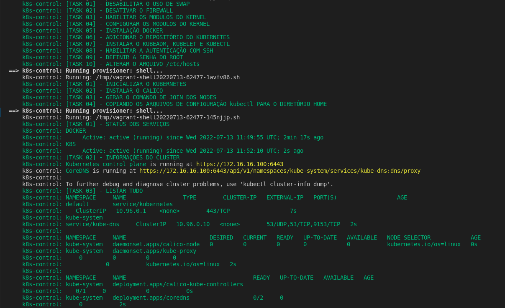

<h1 align="center">Setup Kubernetes </h1>

<p align="center">
  
  
  
</p>

## 🌱 Project

- Setup kubernetes com shell script, vagrant e virtualbox.

## 🗒 Pré requisitos

- vagrant
- virtualbox

## ✨ Ferramentas utilizadas

- Vagrant
- Kubernetes
- Virtualbox
- VsCode

## Arquitetura

- 1 Master
- 3 Nodes

## 🚀 Execução
1. Instalação dos pré-requisitos:

```bash
make requirements
```

2. Subir ambiente

```bash
make setup
```

<p align="center">
  
</p>

3. Remover o ambiente

```bash
make destroy -f
```

4. Parar o ambiente

```bash
make halt
```

## 📄 Licença
Esse projeto está sob a licença MIT. Veja o arquivo [LICENSE](LICENSE) para mais detalhes.